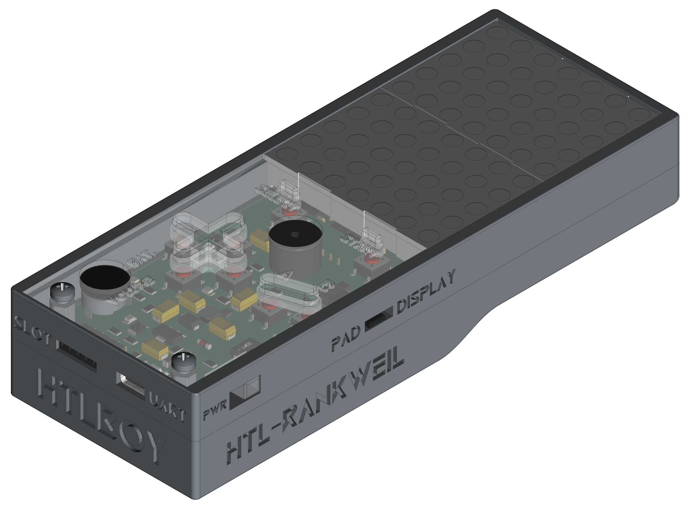
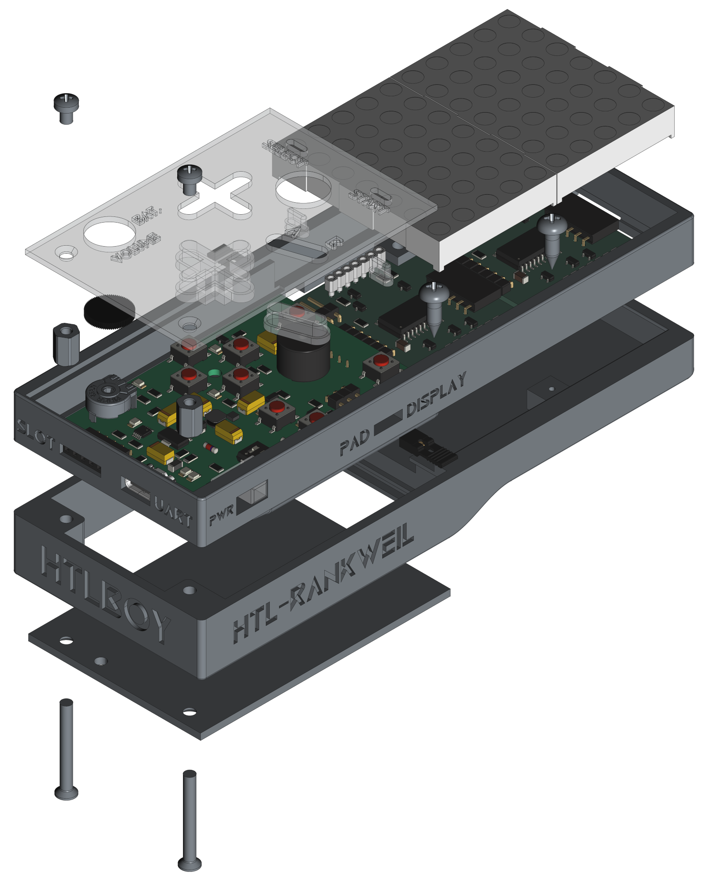
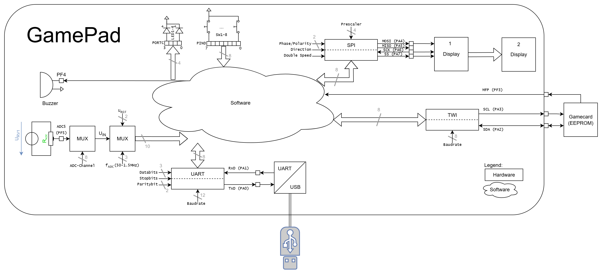

[](https://github.com/0x007e/gap) [](https://creativecommons.org/licenses/by-nc-sa/4.0/legalcode) [](https://www.gnu.org/licenses/gpl-3.0.html)  

# `GAP` - GamePad (HTLboy)

[](https://deepwiki.com/0x007E/gap)

The `GAP` project is based on a pcb with an [ATmega3208/ATmega4808](#additional-information) and is extended with two [Matrix LED Displays](https://github.com/0x007e/mad). It can be used as controller for games and graphical things. The `GAP` has 8 buttons (1 Cross `[4]`, A & B `[2]`, Select `[1]` and Start `[1]`), 4 LEDs, a potentiometer to control the volume and a built in `UPDI` programmer for the pad itself and the connected displays. Data for displays is sent over `SPI`. The `GAP` also implements a battery controller for [LiPo Batteries](#additional-information). They can be charged over USB. The battery can drive the system for about ~5 hours. There is also a `TWI` interface to load games from an `EEPROM` into the system.

| Experience | Level |
|:------------|:-----:|
| Soldering   |  |
| Mechanical  |  |
| Software    |  |

# Downloads

| Type      | File               | Description              |
|:---------:|:------------------:|:-------------------------|
| Schematic | [pdf](https://github.com/0x007E/gap/releases/latest/download/schematic.pdf) / [cadlab](https://cadlab.io/project/29666/main/files) | Schematic files |
| Board | [pdf](https://github.com/0x007E/gap/releases/latest/download/pcb.pdf) / [cadlab](https://cadlab.io/project/29666/main/files) | Board file |
| Drill | [pdf](https://github.com/0x007E/gap/releases/latest/download/drill.pdf) | Drill file |
| PCB | [zip](https://github.com/0x007E/gap/releases/latest/download/kicad.zip) / [tar](https://github.com/0x007E/gap/releases/latest/download/kicad.tar.gz) | KiCAD/Gerber/BoM/Drill files |
| Mechanical | [zip](https://github.com/0x007E/gap/releases/latest/download/freecad.zip) / [tar](https://github.com/0x007E/gap/releases/latest/download/freecad.tar.gz) | FreeCAD/Housing and PCB (STEP) files     |
| Display Firmware | [zip](https://github.com/0x007E/mad/releases/latest/download/firmware.zip) / [tar](https://github.com/0x007E/mad/releases/latest/download/firmware.tar.gz) | Firmware for ATtiny406/ATtiny1606 (Display) |
| Demo Firmware | [zip](https://github.com/0x007E/gap/releases/latest/download/firmware-demo.zip) / [tar](https://github.com/0x007E/gap/releases/latest/download/firmware-demo.tar.gz) | Test application for ATmega3208/ATmega4808 |

# Hardware

There are two parts of the hardware. The pcb (`GAP` + 2x`MAD`) and the housing. The pcb is created with [KiCAD](#additional-information) and the housing with `FreeCAD`. The software is programmed with [Microchip (Atmel) Studio](#additional-information). All files are built with `github actions` so that they are ready for a production environment. The housing is printed with a 3D-printer (`Dremel 3D40`).

## PCB

The circuit board is populated on both sides (Top, Bottom). The best way for soldering the `SMD` components is within a vapor phase soldering system and for the `THT` components with a standard soldering system.

### Top Layer


### Bottom Layer


## Mechanical

The housing has a tolerance of `0.2mm` on each side of the case. So the pcb should fit perfectly in the housing. The tolerance can be modified with `FreeCAD` in the `Parameter` Spreadsheet.

### Assembled



#### Exploded



# Programming/Setup

For programming the `GAP` is necessary to power the system with `5V` over the USB jack. The `GAP` has an integrated `UPDI` programmer and a pin to select the programming device (`Pad` or `Display`). With Jumper `J3/J4` bridged the [UPDI](#additional-information) programmer is enabled. To program the `Pad` it is necessary to set the Jumper `JP2` between the pins `2-3`. If jumper `JP2` is set between `1-2` the `MAD` display(s) can be programmed (set the jumper `JP1` at the display that should be programmed). The firmware for the `pad`/`display` can be downloaded (see the [download section](#downloads)).

``` bash
#              +---+---+---+---+---+---+  
#          +---+ 1 | 2 | 3 | 4 | 5 | 6 +---+
#          |   +---+---+---+---+---+---+ D |
#          |             S               I |
#          |         U   O               S |
#          |     V   P       S       G   P |
#          |     C   D       C   S   N   L |
#          |     C   I       K   S   D   A |
#        +-+---+         S               Y |
# (*) -> | JP1 |         I                 |
#        +-+---+---+---+---+---+---+---+ 2 |
#          +---+ 1 | 2 | 3 | 4 | 5 | 6 +---+
#              +-+-+-+-+-+-+-+-+-+-+-+-+
#                |   |   |   |   |   |
#              +-+-+-+-+-+-+-+-+-+-+-+-+ 
#          +---+ 1 | 2 | 3 | 4 | 5 | 6 +---+
#          |   +---+---+---+---+---+---+ D |
#          |             S               I |
#          |         U   O               S |
#          |     V   P       S       G   P |
#          |     C   D       C   S   N   L |
#          |     C   I       K   S   D   A |
#        +-+---+         S               Y |
# (*) -> | JP1 |         I                 |
#        +-+---+---+---+---+---+---+---+ 1 |
#          +---+ 1 | 2 | 3 | 4 | 5 | 6 +---+
#              +-+-+-+-+-+-+-+-+-+-+-+-+
#                |   |   |   |   |   |
#              +-+-+-+-+-+-+-+-+-+-+-+-+ 
#          +---+ 1 | 2 | 3 | 4 | 5 | 6 +---+
#          |   +---+---+---+---+---+---+   |
#          |     V   U   M   S   S         |
#          |     C   P   O   C   S         |
#          |     C   D       K             |
#          |         I                  +--+-+
#          |                            |  J +       ---+ Program selected (*) MAD
#          |      G                     |  P +---+   ---+
#          |      A                     |  1 +---+ Program GAP
#          |      M                     +--+-+
#          |      E                        |
#          |      P                        |
#          |      A            SW 11       |
#          |      D        U +---+---+     |
#          |               P | X | X |     |
#          |               D | X | X |     |
#          |               I |   |   |     |
#          |                 +---+---+     |
#          |                     +---+     |
#          | +-------+           | U |     |
#          +-+  TWI  +-----------+ S +-----+
#            +-+++++-+           | B |
#                                +-+-+
#                                  |
#                                  |
#                    +-------------+---------+
#                    |                       |
#                    | +-------------------+ |
#                    | | AVR-Dude/TeraTerm | |
#                    | | ~~~~~~~~          | |
#                    | | ~~~~~             | |
#                    | | ~~~~~~~~~~~~      | |
#                    | |                   | |
#                    | +-------------------+ |
#                    |                       |
#                    | Computer              |
#                    |                       |
#                    +-----------------------+
```

## FUSES

| Register  | Value  |
|:---------:|:------:|
| `APPEND`  | `0x00` |
| `BODCFG`  | `0x00` |
| `BOOTEND` | `0x00` |
| `OSCCFG`  | `0x02` |
| `SYSCFG0` | `0xCC` |
| `SYSCFG1` | `0x00` |
| `WDTCFG`  | `0x00` |

> It is necessary to press the reset button during `avr-dude` is running! Otherwise the `UPDI` programming does not work. Remove Jumper `J3`/`J4` after programming.

## Commands

### Gamepad

``` bash
# With ATmega3208                              !PORT
avrdude.exe -c serialupdi -p m3208 -b 57600 -P COM? -U flash:w:"/path/to/file.hex":a -U eeprom:w:"/path/to/file.eep":a -v

# With ATmega4808                              !PORT
avrdude.exe -c serialupdi -p m4808 -b 57600 -P COM? -U flash:w:"/path/to/file.hex":a -U eeprom:w:"/path/to/file.eep":a -v
```

### Display

``` bash
# With ATtiny406                              !PORT
avrdude.exe -c serialupdi -p t406 -b 57600 -P COM? -U flash:w:"/path/to/file.hex":a -U eeprom:w:"/path/to/file.eep":a -v

# With ATtiny1606                              !PORT
avrdude.exe -c serialupdi -p t1606 -b 57600 -P COM? -U flash:w:"/path/to/file.hex":a -U eeprom:w:"/path/to/file.eep":a -v
```

# Software

The gamepad can be controlled with different libraries to read the input, set the output and control the data on display. An overview of the interfaces are displayed in the [dataflow](#dataflow-diagram) diagram. There is a demo software that is using the libraries to setup and control the gamepad and display (`GAP_LIB`) and a simple game (`GAP_GAME`).

## Dataflow diagram



### Example Library (`matrix.h`)

With the attached demo library (`MAD_LIB`) it is quiet easy to use the display. To setup the matrix display library some `defines` needs to be adjusted.

``` c
// Setup the number of displays that are cascaded in matrix.h
#ifndef MATRIX_DISPLAYS
    #define MATRIX_DISPLAYS 2
#endif
```

``` c
#include "../lib/matrix/matrix.h"

int main(void)
{
    matrix_init();
    matrix_reset();
    _delay_ms(MATRIX_RESET_RECOVERY_TIME_MS);
    matrix_enable();

    matrix_char(1, 'A');
    _delay_ms(1000);
    matrix_char(2, 'B');

    matrix_frame(buffer);
    // ...
}
```

# Additional Information

| Type       | Link               | Description              |
|:----------:|:------------------:|:-------------------------|
| ATtiny406  | [pdf](https://ww1.microchip.com/downloads/en/DeviceDoc/Microchip%208bit%20mcu%20AVR%20ATtiny406%20data%20sheet%2040001976A.pdf) | ATtiny microcontroller |
| ATtiny1606 | [pdf](http://ww1.microchip.com/downloads/en/DeviceDoc/ATtiny806_1606_Data_Sheet_40002029A.pdf) | ATtiny microcontroller |
| ATmega3208 | [pdf](https://ww1.microchip.com/downloads/en/DeviceDoc/ATmega3208-3209-Data-Sheet-DS40002174A.pdf) | Microchip ATmega Datasheet |
| ATmega4808 | [pdf](https://ww1.microchip.com/downloads/en/DeviceDoc/ATmega4808-4809-Data-Sheet-DS40002173A.pdf) | Microchip ATmega Datasheet |
| TA20-11SRWA | [pdf](https://www.kingbrightusa.com/images/catalog/spec/ta20-11srwa.pdf) | Dot Matrix Dispaly |
| Atmel ICE | [pdf](https://ww1.microchip.com/downloads/en/DeviceDoc/Atmel-ICE_UserGuide.pdf) | Atmel ICE datasheet |
| UPDI | [web](https://github.com/0x007e/updi) | UPDI-Adapter with AVR-Dude |
| Microchip Studio | [web](https://www.microchip.com/en-us/tools-resources/develop/microchip-studio) | Download page for Microchip Studio |
| KiCAD | [web](https://www.kicad.org/) | KiCAD project page |
| FreeCAD | [web](https://www.freecad.org/) | FreeCAD project page |
| TeraTerm | [web](https://github.com/TeraTermProject/teraterm/releases/download/v5.3/teraterm-5.3.zip) | Terminal software for UART |

---

R. GAECHTER
